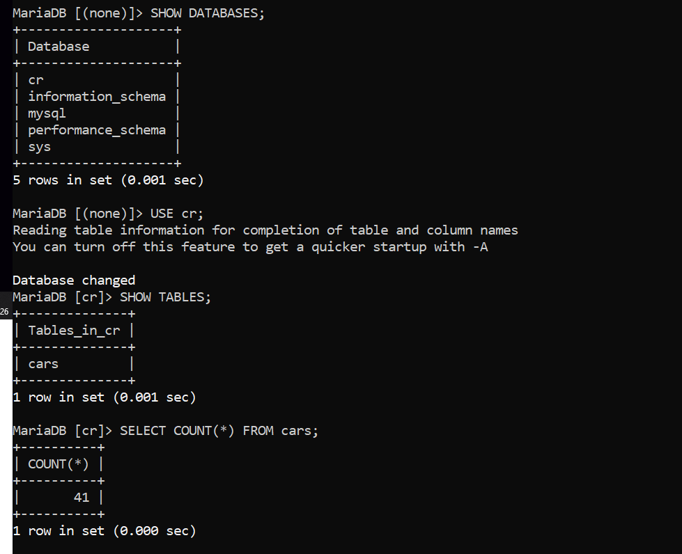
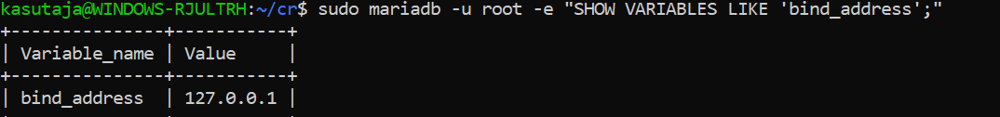

## 1. Paigalduskeskkond ja ligipääs

### Kasutatud keskkond: WSL2 + UBUNTU.

#### Ülesande alguses lõin kasutaja nimega kasutaja, alles hiljem märkasin et kasutajanimes peab olema minu nimi.
### Lahendusena ma hetkel lisasin käsuga sudo adduser enda nimelise kasutaja. 
 
### Keskkonnale pääseb ligi konsooli kaudu.

## 2. MariaDB server

### Kasutatud käsud:

### Sudo apt update                         -- uuendus
### Sudo apt install mariadb-server  	 -- MariaDB allalaadimine
### mariadb --version			 -- MariaDB versiooni kuvamine
### sudo systemctl restart mariadb		 -- Teenuse restart (et muudatused rakenduksid) 
### sudo systemctl status mariadb		 -- Teenuse oleku kontrollimine (aktiivne v ei)

### Kas teenud käivitub automaatselt? Jah, sest systemctl status mariadb käsk kuvab et teenus on enabled ja aktiivne.

### MariaDB versioon: mariadb  Ver 15.1 Distrib 10.11.14-MariaDB, for debian-linux-gnu (x86_64) using  EditLine wrapper

## 3. MariaDB turvaseadistus

### Unix_Socket = Yes
### Remove anonymus Users = Yes
### Disallow remotely root login = Yes
### Remove test database and access to it = Yes
### Reload privilege tables now = Yes 

## 4. Võrguturve

### bind-address = 127.0.01  = Oli olemas, ei muutnud midagi
### local-infile = 0         = Pidin juurde lisama, oli failist puudu
### skip-name-resolve	   = Võtsin ainult # eest ehk tegin selle rea aktiivseks.

## 5. MariaDB kontroll

### ss -tlnp | grep 3306			 -- Kontrollib, kas MariaDB kasutab seda porti. (ss -tlnp | grep mariadb ei andnud mul tulemust)

## 6. Kuvatõmmised

### Mariadb andmebaas:

### Port 3306: 

### Bind aadress

